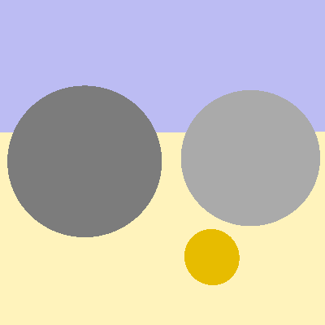
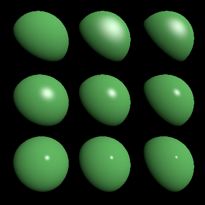
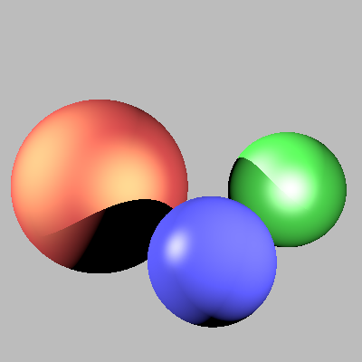

## 1- Rayons

On veut visualiser des objets grâce à la technique de Ray-tracing. Tout d'abord j'ai commencé à implémenter la fonction Render de main.cpp pour pouvoir lancer un rayon. Dans cette partie le chargé de Td nous a grandement aidé pour pouvoir créer le vecteur directionnel 'd' à l'aide de 'dprime' qui utilise les positions des caméras et des vecteurs camX,camY et CamF en faisans un parcours pour chaque pixel de la grille.
L'étape suivante était de trouver l'intersection la plus proche entre le rayon et les objets de la scène. J'ai donc implémenter la méthode scene::intersect qu'on va pouvoir utiliser ci-dessous.

## 2- Sphères

La fontion Sphere::intersect était à implémenter. Il s'agit de calculer le discriminant de l'équation donnée dans l'énoncé. La fonction n'était pas très compliqué mise à part qu'on ne peut pas multiplier deux vecteurs avec une simple "*". Pour calculer deux vecteurs il faut faire le produit scalaire grâce à l'opération dot(). De plus, pour calculer la norme au carré d'un point ou d'un vecteur il faut utiliser squareNorm().

## 3- Affichage d'image

Pour afficher une image et calculer la couleur d'un pixel il faut utiliser l'intégrateur de la scène. J'ai donc implémenté la méthode Integrator::Li() pour retourné la couleur de l'objet intersecté dans le fichier flat.cpp. Dans la fonction main.cpp, il ne faut pas oublié d'appeller justement cette fonction et notamment la fonction ImageBlock::put() qui stocke la couleur dans l'image résultat.
En 

## 3- Plans

Il fallait dans ce fichier implémenter plane::intersect pour calculer l'intersection avec un plan. Il s'agissait de calculer une équation linéaire (p-a).n=0 en t. Il y avait quelques subtilités à assimiler parmi deux des quatres cas. t est infini veut dire que le numérateur est égale à 0. t est non défini implique que le dénominateur est égale à 0.

En utilisant plane::intersect on obtient l'image suivante avec petanque.scn:

## 4- Éclairages

Pour cette partie , il fallait calculer l'éclairage local pour des sources lumineuses en utilisant le modèle de brdf de Phong.
Pour cela j'ai tout d'abord implémenter un nouvel intégrateur Normals
qui affecte à chaque pixel une couleur représentant sa normale. Je n'ai pas eu du mal à implémenter cette méthode dans le fichier normals.cpp. En revanche, lorque j'affichais troisSphere.scn par exemple les sphères étaient toutes noirs. J'ai eu du mal à trouver le problème. C'est dans sphere::intersect que je ne calculais pas correctement la normale. Il fallait initialiser la normal comme étant le point d'intersection moins le centre de la sphère:
const Normal3f normal = o + t0 * d - m_center;

Maintenant, l'image est la bonne. 

Pour de ce qui est du calcul de l'éclairage j'ai implémenté un nouvel intégrateur direct qui calcul la couleur au point d'intersection selon une équation R donnée dans l'énoncé.Il fallait de plus implémenter deux méthodes de la classe light direction et intensity dans le fichier pointLight.cpp. J'ai testé avec le fichier de scène troisSpheres et Phong. Je trouve ainsi l'image suivante:

## 5- Ombres

J'ai modifié l'intégrateur direct pour ajouté les ombres portées. Il faut lancer un rayon en direction de la lumière, et testez s'il y a intersection. J'ai donc implémenter un nouveu rayon et j'ai tester s'il y a intersection avec ce nouveu rayon. Enfin, j'ai comparé le temps d'intersection avec la distance à la lampe : s'il est inférieur, un objet bloque la lumière. 

## 6- Rebonds multiples

Je n'ai malheureusment pas eu le temps de terminer le fichier de l'intégrateur whitted.