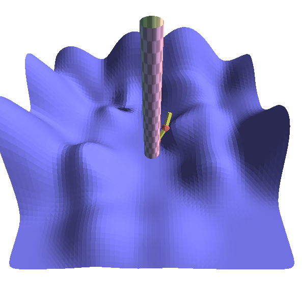

## TD10 - Cinématique inverse et skinning

# 1-Rendu du bras articulé 

J'ai en effet affiché correctement le bras articulé.  Le chargé de td nous a donné quelques fonctions Eigen qui m'a grandement aidé pour la réalisation de ce bras.
Voici ce que j'affiche :

# 2-Inverse Kinematic (IK)

Pour cette étape j'ai repris ce que j'avais fais pour le bras. 
J'ai en suite suivi les étapes fournies dans l'énoncé. J'ai eu un peu de mal surtout pour l'écriture de la matrice jacobienne. C'est une matrice de type Matrix4f alors que j'avais précédemment utilisé un VectorXf::Map. POur calculer Q pour la descente de gradient il fallait en fait utiliser ici la fonction Eigen Map.

Voici ce que j'affiche à l'écran:

On peut pas trop le voir ici mais quand j'utilise ctrl-click le bras minimise l'erreur c'est-à-dire la distance entre le point et le target(point vert).

# 3. Skinning

J'ai appliqué le skinning rigide. J'ai tout d'abord intégré les shaders du td8. Ensuite j'ai utilisé un booléen _cyl qui ressemble à wireframe au niveau du code mais c'est pour ajouter des conditions dans le shader. Si c'est un cylindre j'affiche le cylindre avec sa texture sinon j'affiche la position.

Le cylindre est sur l'axe z.

Voici l'image:

La partie 2 se concentre sur le skinning rigide dans drawArticulateArm. J'ai stocké un tableau Mj=Tj*Bj (produit matricielle) à l'aide de glMatrixUniform et je l'ai passé au shader. Ici il fallait utilisé la position de la texture v et dire si v fait parti soit du segment 1 2 ou 3. On retourne les matrices appropriées pour chaque segment. Mon cylindre s'adapte au bras comme une sorte de "peau" mais au niveau des plis ce n'est pas complètement ça. 

Voici ce que j'affiche:

Je n'ai pas pu faire le skinning linéaires par manque de temps.