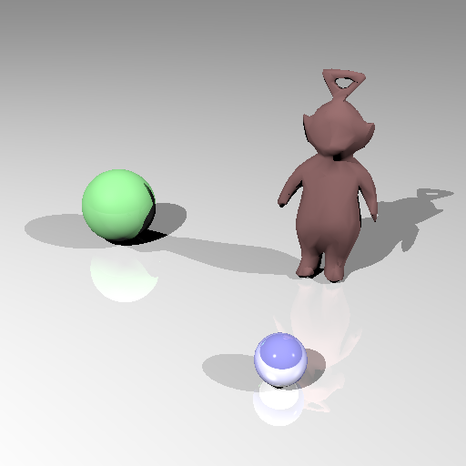
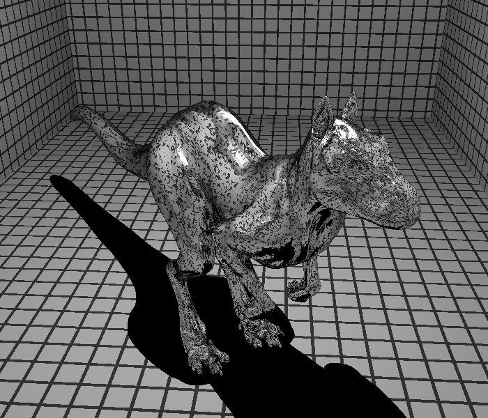

## 1- Intersection triangle

J'ai calculé l'intersection d'un rayon avec un triangle (faceId) grâce à la technique de Möller-Trumbore. J'ai donc dans un premier temps récupéré les sommets du triangle (3 sommets). Ensuite, j'ai calculé l'intersection en faisant un calcul de matrice. J'ai récupéré t (la distance), u et v (les coordonées du point dans le triangle). J'ai utilisé la normal au point d'intersection.
Puis, j'ai crée une condition tel que u et v soit strictement supérieur à 0, je met à jour la normal, la distance t et la shape.
J'ai ensuite appliqué le raytracing pas seulement sur une face mais sur le maillage complet en m'aidant d'une boucle for. 
J'ai eu du mal à afficher la bonne image avec le teletubbies car je ne crée pas une nouvelle hit.
 En corrigeant cela j'ai trouvé la solution.
 L'image compte 1006 triangles.
 Le résultat de l'image est le suivant:

Pour avoir une normal par sommet j'ai modifié intersectFace pour y ajouter cette formule: 
u * A.normal + v * B.normal + (1 - u - v) * C.normal

qui concretement permet d'avoir un teletubbies plus lisse.

Voici l'image résultante:

La derniere image et le résultat d'une petite modification dans le fichier de scene tw.scn.
L'image compte 12576 triangles beaucoup plus que les images précédentes. Le temps de calcul est bien sur plus long.

## 2- BVH buildNode

J'ai implémenté cette méthode. Je donne la position de chaque sommet de chaque face pour avoir leurs coordonnées. Puis, je détermine s'il s'agit d'une feuille en appliquant la condition maxDepth<= level.
Avec le "level" qui représente la profondeur actuelle dans l'arbre. Si il s'agit d'un noeud interne, je prend la plus grande dimension entre x, y et z. J'ai trouvé cette partie compliquée car je ne savais pas quelles formules et quels types utilisés. Pour récupérer les coordonnées, j'ai utilisé par exemple node.box.sizes.x() pour récupérer la coordonnées du point x.
Ensuite, j'utilise la fonction split qui prend en paramètre  start end, la dimension et la valeur de plan de coupe. Cette dernière est la dimension /2 car on veut couper à la moitié.

## 3- BVH intersectNode

J'ai implémenté BVH::intersect qui vérifie qu'on a bien une intersection et si oui appel intersectNode.
Je met NodeId à 0.

En revanche, la partie sur BVH::intersectNode j'ai pas mal de problèmes. 
Tout d'abord on peut noter deux cas. 

Cas n°1:

Si le noeud est une feuille dans ce cas on intersecte les triangles(faces) du noeud donc on utilise intersectface.

Cas n°2:

Si le noeud est un noeud interne, alors on parcours ses fils. Dans ce cas, je ne comprend pas comment parcourir les fils du noeud en question. Est-ce une histoire de boite gauche et boite droite?
J'ai tout de même implémenté intersect pour le fils droit et le fils gauche.

Le code sur la partie BVH dans le fichier Mesh.cpp est volontairement mis en commentaire pour éviter de mélanger la 1ere partie sur le calcul d'intersection sans BVH.

J'obtiens une image après 24 minutes d'attente avec killeroo.scn.

