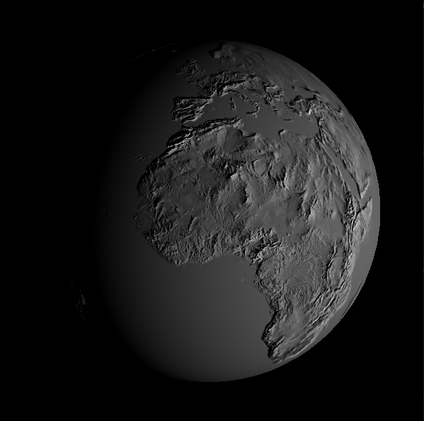

# TD7-Normale mapping

## 1-Introduction

Le principe de l'approche de normal mapping est de stocker dans une texture une carte des normales détaillées qui sera utilisée pour perturber le calcul d'éclairage. 

## 2- Normal mapping sur un plan 

J'ai appliqué le normal mapping sur un plan dont les normales perturbées sont exprimées en espace objet. J'ai eu du mal à visualiser la perturbation de l'éclairage car je ne savais pas trop au début comment m'y prendre. J'ai appliqué la texture de la normal avec texture(texnormal,texcoord) puis il fallait faire une opération et multiplié par 2 pour avoir un rendu correcte. J'ai ajouté ce vecteur au premier paramètre de la fonction blinn à la place de la normale. Les textures sont comprises entre [-1,1] , j'ai donc normalisé pour avoir un résulat sur [0,1]. Enfin, j'ai multiplié tout cela par la matrice des normales pour prendre en compte la transformation de la caméra.

Ensuite je n'ai pa eu de mal à appliquer la texture diffuse. Le résultat final et le résultat de la texture diffuse + la carte de normales + la perturbation de l'éclairage. 

J'ai juste un problème avec mon affichage du plan. La texture ne s'applique pas sur tout le plan.

## 3- Calcul du repère tangent

La carte des normales est en effet exprimée dans le repère tangent. J'ai donc caculer la tangente et la bitangente dans la méthode Mesh::ComputeNormale. Je n'ai pas eu de soucie particulier pour ce calcul. J'ai initialisé la tangent et la bitangent dans le fichier mesh.h avec la normal.

## 4-  Normal mapping sur une sphère

Dans cette partie j'ai transformé la normale du repère tangent au repère de l'objet au repère de la vue.
Pour cela j'ai multiplié par la matrice des normales et j'ai normalisé la tangent, la bitangent. Enusite, dans le fragment shader j'ai crée la matrice tbnvMatrix et j'ai crée les vecteurs lt et vt en multipliant la matrice tbnvMatrix par lv et tv.
Enfin, j'ai appliqué pratiquement le même calcul que celui pour la carte des normales. La texture n'est pas la même. On utilise pour cela earth_normal.png. Dans la fonction blinn il fallait juste remplacer les anciens l et v par lt et vt.

La texture earth_normal:

Voici la perturbation de l'éclairage diffus:

Et voici le résultat final avec la texture de couleur:

Si on utilise le normal mapping avec le modèle de jerry the ogre.

Image calculée avec la normal du maillage:

Image calculée avec la normal map:

On peut voir la différence entre les deux notamment au niveau des rides et des points sur le visage.

