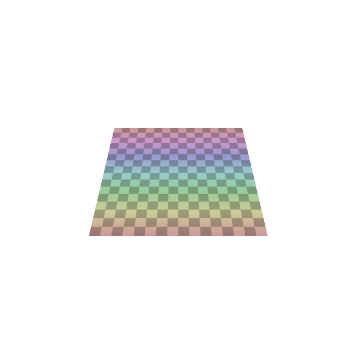
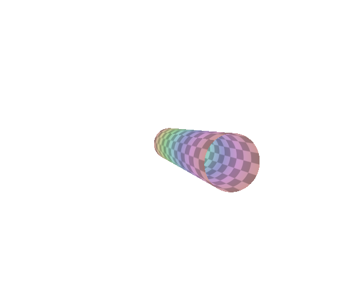
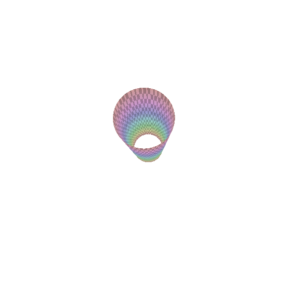
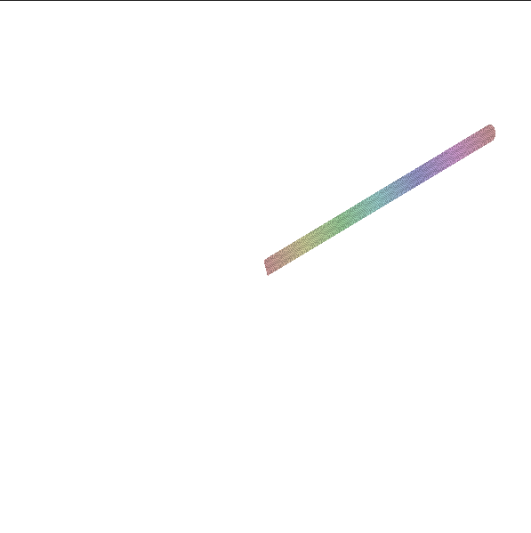
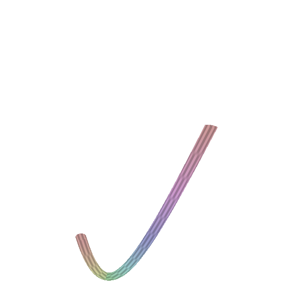
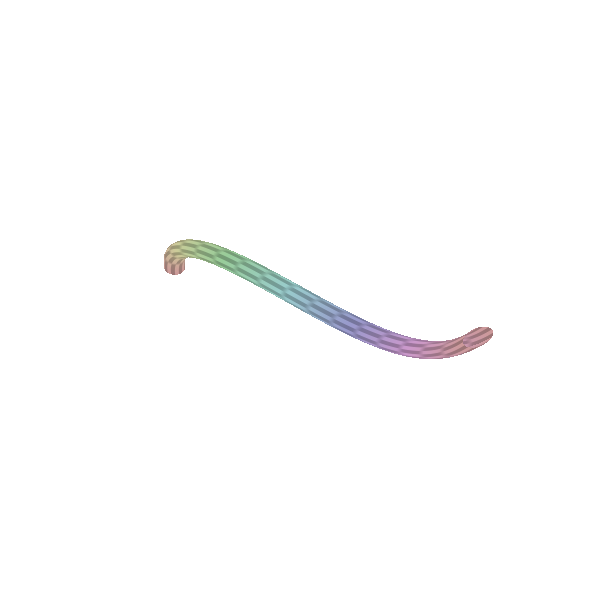

# TP8 Courbes et surfaces paramétriques

L'objectif de ce TP est de construire des surfaces définies à partir de courbes paramétriques.

## 1-Grille régulière

Donné par le chargé de TD.

## 2- Cylindre

Tout d'abord pour tracer un cylindre défini par deux points A et B et un rayon r, j'ai calculer la fonction S(u,v) en utilisant la méthode de la surface de révolution. En effet, on peut voir une révolution du point p autour de l'axe XY. 

Ensuite, j'ai crée un cylindre de sorte que le cercle de centre A ne soit pas dans le même axe (x ou z) que le cercle de centre B.
C'est-à-dire que le cylindre doit être penché.
J'ai ici utilisé la même méthode que précedemment. Pour le calule , j'ai additionné par une interpolation.

Enfin pour la dernière étape j'ai ici utilisé la méthode de l'extrusion. J'ai utilisé la tangent au point sa normal et puis sa binormal. La tangente est en fait la direction du segment AB. En ayant ces trois données, j'ai essayé de faire un changement de repère c'est-à-dire passer du repère local au repère monde. Je n'ai pas réussi à faire correctement cette étape. Enfin il faut ajouter la translation.

## 3- Courbes de Bézier

Dans cette partie il fallait tracer une courbe de bézier définit par quatre points. Il faut extruder un cercle défini dans le plan YZ le long de cette courbe. Pour cela j'ai écrit la fonction vec3 bézier qui calcul la position du point p sur la courbe. J'ai pour cela utiliser l'interpolation linéaire le long de chacun des quatres segments et j'ai trouvé le p(u) recherché.

Ensuite j'ai utilisé cette fonction pour évaluer la surface paramétrique en ce point. Je trouve ainsi les images suivantes:

Nous allons maintenant généraliser la fonction précédente de manière à ce que le plan support du cercle suive la trajectoire définie par la courbe.
On doit contrôler la rotation du cercle autour de ce vecteur tangent. Pour cela il fallait étendre la fonction bezier pour pouvoir retourner le vecteur tangent.

Donc cette fonction retourne T le vecteur tangent. Pour de ce qui est de la fonction qui dessine la surface paramétrique je n'ai pas réussi à afficher une image sur la fenêtre graphique. 

