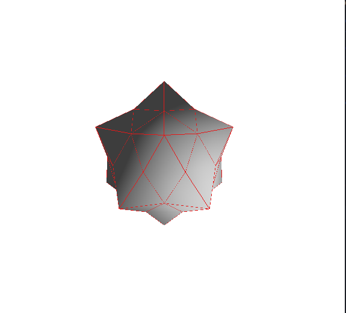
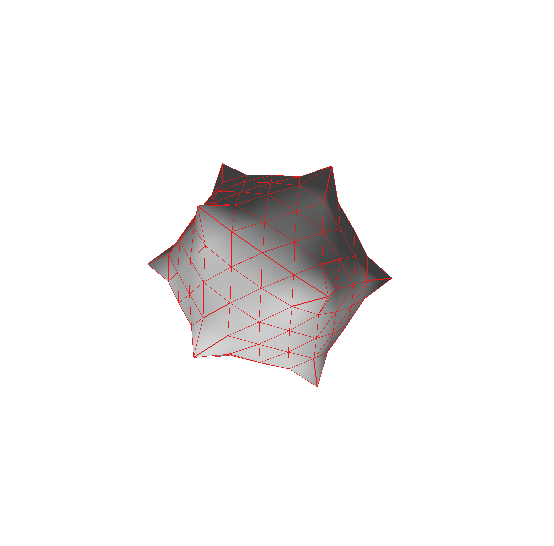
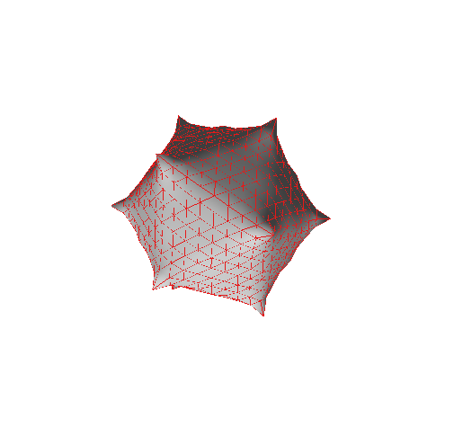
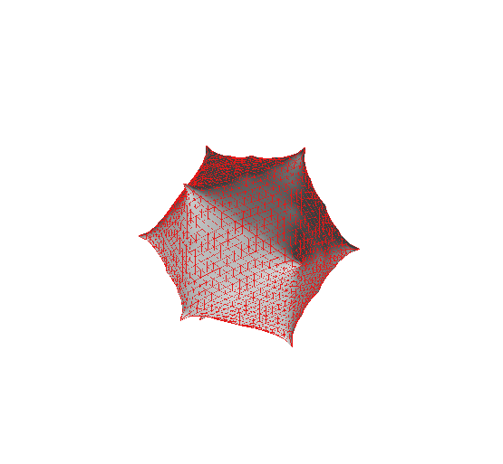
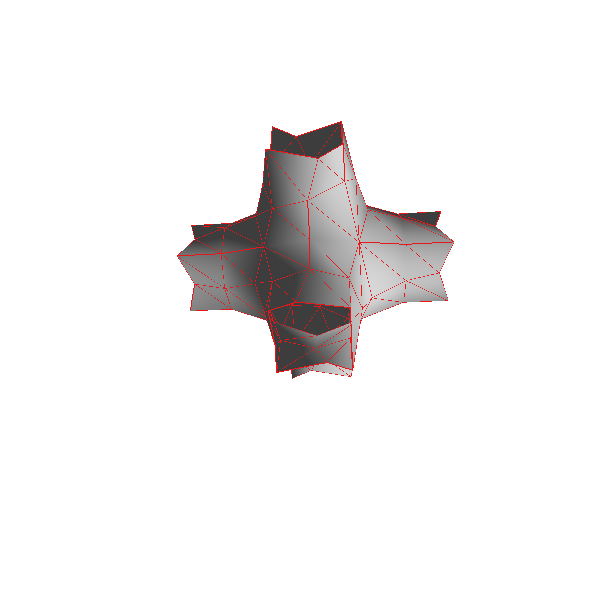
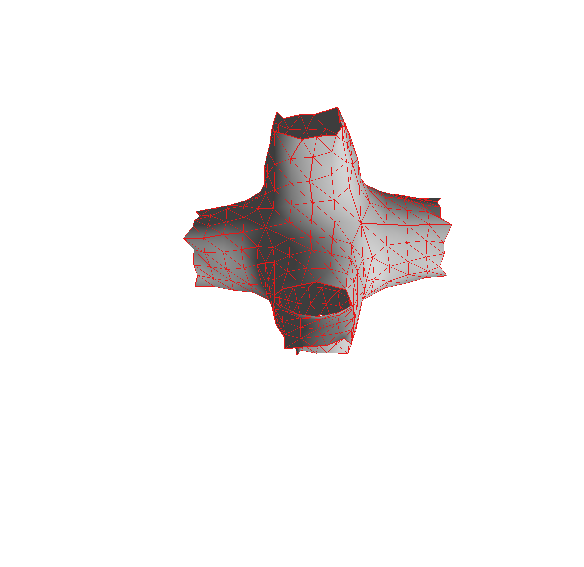
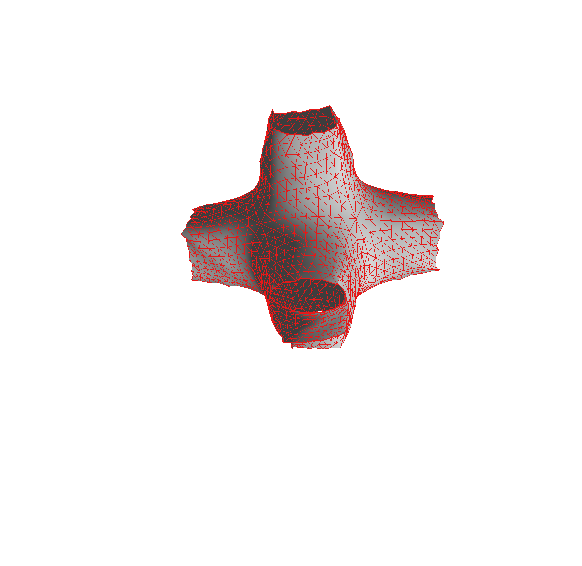
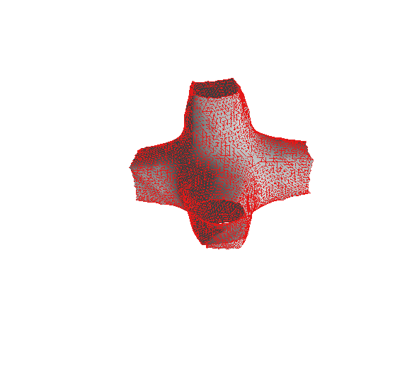

# TD9- Surfaces de subdivision

## 1- Principe

Le principe de ce td est d'implémenter un schéma de subdivision Loop qui ne s'applique qu'aux maillages triangulaires. Il subdivise le triangle en quatre.

Ici on utilise un algorithme décrit dans l'énoncé du tp.

## 2-Implémentation

Tout d'abord j'ai commencé par l'étape 3 comme conseillé dans l'énoncé. Le chargé de td nous a tout d'abord aidé a initialiser 2 tableaux de vertex pour le mapping entre les sommets et pour les arètes.
De plus, dans le cours nous avons vu des structures très importantes pour manipuler des demies-arètes(halfedge). J'ai utilisé la structure sur les sommets pour parcourir les voisins d'un sommet donné.
Donc le principe de cette étape est de calculé la nouvelle position des sommets initiaux. 
Pour cela j'ai eu du mal à comprendre l'utilisation de la somme de vij de j allant de 1 à di.
Finalement, avec un peu d'aide du professeur j'ai compris que vij correspondait au sommet voisin du sommet i(sommet source) et qu'on calculait la somme des coordonnées des sommets voisins du sommets i.
En faisant un do-while j'ai pu ajouter à chaque nouvelle demie-arete une nouvelle coordonnées dans ma variable cog. 

Enfin, j'ai suivi le reste de la formule dans le cours pour finir cette étape. En utilisant notamment des boucles if. Il n'y avait plus qu'à stocker le mapping entre les sommets dans un tableau vertex_mapping.

Ensuite j'ai effectué l'étape 1 qui consiste à insérer un nouveau sommet pour chacune des arètes de chaque triangle à la position donnée dans l'algorithme. Cette partie était un peu compliqué car à la base j'ai initialisé les 4 points( des deux triangles) dans la boucle for avec toujours les mêmes coordonnées. Finalement, je me suis rendu compte que ca n'avait aucun sens car les points sont de coordonnées différentes à chaque tour de boucle (pour pouvoir scanner tout le modèle). J'ai donc suivi le même modèle que sur le site "https://www.labri.fr/perso/pbenard/teaching/surface_mesh/usage.html"
(à la fin de la page).
Avec une attention particulière pour _halfedge.to_vertex et half_edge.from_vertex qui sont deux fonctions différentes à utiliser dans ce cas la. 
Le plus compliqué ici était de définir la position de chaque point par rapport à halfedge.
Ensuite, il ne fallait plus qu'à ajouter chaque nouveau point dans le tableau edge_mapping en spécifiant la position des 4 autres points à l'aide de la formule.

Finalement j'ai fais l'étape 2 qui consiste à mettre à jour la copie des faces précédentes de manière à créer, pour chaque face de l'ancien maillage, 4 nouveaux triangles dans le nouvel half-edge en utilisant les deux mappings et la fonction add_triangle. 

J'ai donc utilisé une boucle do-while pour parcourir les sommets d'une face. Je me suis aidé du cours pour cela. Pendant la séance de td, le prof nous a aidé pour le commencement de cette boucle en nous donnant une façon parmis d'autres pour stocker :
vs[i] = vertex_mapping[_halfedge.to_vertex(h)];
J'ai donc utiliser notamment le edge_mapping qui contient les nouveaux sommets.
us[i] = edge_mapping[_halfedge.edge(h)];
i++;
Enfin, j'ai ajouté les 4 nouveaux triangles à l'aide de la fonction add_triangle() en respectant l'ordre des sommets.

J'ai un problème au niveau de l'implémentation car je n'ai pas exactement la même image que sur un modèle normal.

Voici les images sur icosa.obj:

## Bords ouverts

La partie sur les bords consistait à considérer des maillages possédant des bords ouverts. J'ai donc appliqué la fonction donné dans l'énoncé pour l'étape 1 et 3.

Pour l'étape 1, il fallait tout simplement rajouter une condition if en ajoutant la formule dans l'algortihme.
Pour l'étape 3 j'ai trouvé ça plus difficile. J'ai appliqué une boucle do-while en ajoutant une condition pour voir si c'est une arête à bord ouvert ou pas. Si oui on itère sur les voisins du sommet source. On récupère à l'aide de la variable cog la position du sommet sur la demie-arête affectée par la bordure et puis on utilise la formule donnée dans l'algorithme et on l'ajoute dans le vertex_mapping.

Voici les images sur pipes.obj:

